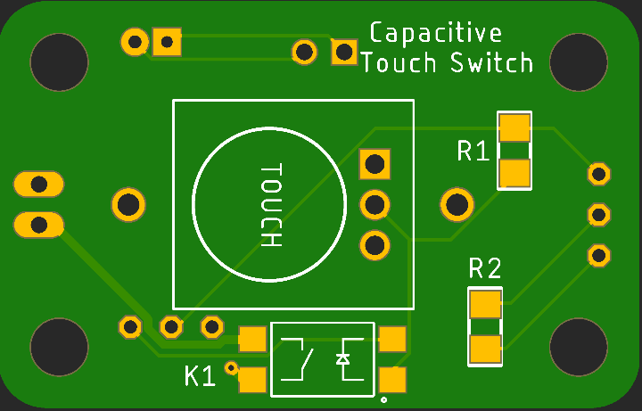

# Cap Switch Board

## Introduction

This project aims to create a small capacitive touch switch that uses a CR2032 button cell to power a capacitive touch sensor and solid state relay to to assist with switch-adapting a device for assistive technology purposes.

Support for various battery options has been implemented via an external battery jack that can be connected to a battery or battery holder (AA, AAA, NiCd/NMH/Li-ion/LiPo/LiFePO4). Li-ion/LiPo charging via USB could be supported via the addition of a TP4056/DW01 module.

## Status

| Date       | Status                   |
| ---------- | ------------------------ |
| 2022-12-27 | First posting. Untested. |

## Todo

* Add on-off switch?
* Make sure SSR height (4mm) doesn't interfere with board mounting and sensor access.

## Components

Two options are provided for powering this board. Parts for one option or the other could be purchased, or both.

1. a CR2032 "coin"cell
2. some combination of AA, AAA (alkaline or rechargeable NMH) or a Li-ion, Li-Po, or LiFePO4 lithium cell. (Do not exceed the 5.5V maximum voltage of the touch sensor.)

The first will use the coin cell holder, the second will use a JST XH 2.5mm or similar 2.54mm pitch connection option.

| Component                          | Source                                                       | Specs                                                        |
| ---------------------------------- | ------------------------------------------------------------ | ------------------------------------------------------------ |
| Capacitive touch sensor board (S1) | [HiLetgo TTP223-BA6 Cap Switch](https://smile.amazon.com/dp/B01D1D0FLG) (Amazon ) ([datasheet](../assets/Cap-Touch-TTP223.pdf)) | 2.0-5.5V  3µA max Toggle\|Momentary, Active High\|Low        |
| Solid State Relay (K1)             | [Toshiba TLP241A](https://www.digikey.com/short/rw8vd8dn) ([datasheet](https://toshiba.semicon-storage.com/info/TLP241A_datasheet_en_20200217.pdf?did=14237&prodName=TLP241A)) | LED: 7.5mA Vf: 1.27V Iout: 2A continuous, 6A pulsed Ron: 90mΩ |
| NPN Transistors Q1,Q2              | On Semi [PN2222ABU](https://www.digikey.com/short/n4rrtfnb)  |                                                              |
| Resistor 1.0 / 2.2/3.3kΩ (R1) 1206 |                                                              | 1/4W 5% 1206                                                 |
| Resistor 47 or 56Ω (R2) 1206       |                                                              | 1/4W 5% 1206                                                 |
| Switch Lead Connector              | 0.1" or 2.54mm pitch connector or header posts               |                                                              |
| **Button Cell Option**             |                                                              |                                                              |
| Coin Cell Holder (B1)              | [Keystone 1026](https://www.digikey.com/short/f35w9mv4) ([datasheet](https://www.keyelco.com/userAssets/file/M65p3.pdf)) | 4.5mm standoffs, (1) CR2032  or (2) CR2016 or 2025s       |
| CR2032 Coin Cells (B1)             |                                                              | 3V nominal                                                   |
| **External Battery Option**        |                                                              |                                                              |
| External Battery Connector         | JST XH 2.5mm pitch, straight                                 |                                                              |

Using lower resistance values for R1 will increase the current draw ever so slightly.

Using lower resistance values for R2 will increase the current draw by a meaningful amount.

## Mounting

The board is intended to be mounted with the cap sensor exposed. There are 3.5mm holes for securing with M3 screws or 3D printed posts.

On the bottom is a button cell holder for (1) CR2032 cells.

## Cap Touch Sensor

## Printed Circuit Board

### Top

### Bottom

### Schematic

## TTP223-BA6 Pinout & Modes

| Pin  | Function        |                                                              |
| :--: | --------------- | ------------------------------------------------------------ |
|  1   | Q               | Output pin (open drain).                                     |
|  2   | Vss (GND)       | Ground: 0V                                                   |
|  3   | I               | Input to Oscillator circuit.                                 |
|  4   | TOG (Jumper B)  | 1-Toggle or 0-Momentary mode.                                |
|  5   | Vdd (V+)        | Power: 2.0 - 5.5VDC                                          |
|  6   | AHLB (Jumper A) | Active 1-High or 0-Low output.                               |
|      | LPMB = 0        | Low Power Mode on. (Not Fast Mode)                           |
|      | MOTB = 1        | Max On Time 100s disabled. Infinite On if covered and detected. |
|      | SLRFTB = 1      | Sampling Rate: 1.6ms. Lower current and sensitivity.         |

### Board Jumpers

Leave Jumper A open for an Active High output unless you want to invert the operation of the relay.

Short Jumper B to switch from Momentary mode to Toggle mode.

## Run Time Calculations

| Item                       | Capacity  / Current Draw | Hours  |
| -------------------------- | :----------------------: | :----: |
| Cell Capacity, CR2032      |    240mAh (at 200µA)     |        |
| Cap Touch Board            |        3µA (max)         | 80,000 |
| Cap Touch Board & SS Relay |          10.7mA          |  22.4  |

External battery options will provide considerably longer run times.

## Battery Options

A JST XH socket has been added to provide the option of using an alternate battery pack.

| Batteries Used                             | Max/Nom/Min Voltages (<5.5V!) |
| ------------------------------------------ | :---------------------------: |
| 1 x CR2032                                 |        3.4 / 3.0 / 2.7        |
| 2 x NiCd or NMH (recharable) AA or AAA     |        3.0 / 2.4 / 2.3        |
| 2 x Alkaline AA or AAA                     |         3.3 / 3.0 / ?         |
| 3 x NiCd or NMH (recharable) AA or AAA     |       4.5 / 3.6 / 3.45        |
| 3 x Alkaline AA or AAA                     |        4.95 / 4.5 / ?         |
| 1 x Li-ion (e.g. 18650) or LiPo pouch cell |        4.2 / 3.7 / 2.5        |
| 1 x LiFePO4 (LFP) cell                     |       3.65 / 3.2 / 2.0        |

**Do not use 2 x CR2016 cells** in the button cell holder as that exceeds the maximum voltage of the touch sensor.

## LED Current Driver

This 2-transistor current driver will maintain the SS Relay optical input current at about 10mA across the input voltage range of 2.0 to 4.5V. The circuit is simulated at [Falstad circuit.js](https://tinyurl.com/2kyk5f8h) with sliders on the right for input voltage and the collector resistor value. There's an ammeter and voltage probe for the LED.

The top transistor will conduct current until the voltage drop across the 56Ω resistor approaches 0.7V, turning on the lower transistor. As the lower transistor turns on it will start pulling the base of the upper transistor to ground, turning off the upper transistor which will reduce the LED current to an equilibrium point.

