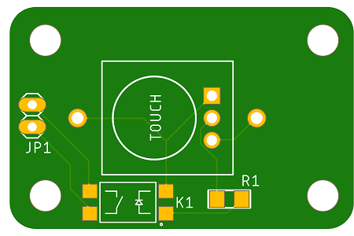
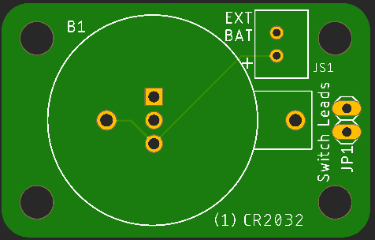

# Cap Switch Project

## Introduction

This project aims to create a capacitive touch switch that uses a CR2032 button cell to power a capacitive touch sensor and solid state relay to to assist with switch-adapting a device for assistive technology purposes.

## Status

| Date       | Status                   |
| ---------- | ------------------------ |
| 2022-12-21 | First posting. Untested. |

## Todo

* Add on-off switch?
* Make sure SSR height (4mm) doesn't interfere with board mounting and sensor access.

## Components

| Component                          | Source                                                       | Specs                                                        |
| ---------------------------------- | ------------------------------------------------------------ | ------------------------------------------------------------ |
| Capacitive touch sensor board (S1) | [HiLetgo TTP223-BA6 Cap Switch](https://smile.amazon.com/dp/B01D1D0FLG) (Amazon ) ([datasheet](assets/Cap-Touch-TTP223.pdf)) | 2.0-5.5V  3µA max Toggle\|Momentary, Active High\|Low        |
| Solid State Relay (K1)             | [Toshiba TLP241A](https://www.digikey.com/short/rw8vd8dn) ([datasheet](https://toshiba.semicon-storage.com/info/TLP241A_datasheet_en_20200217.pdf?did=14237&prodName=TLP241A)) | LED: 7.5mA Vf: 1.27V Iout: 2A continuous, 6A pulsed Ron: 90mΩ |
| Resistor 180Ω (R1) 1206            | [Stackpole 180Ω](https://www.digikey.com/short/m5wfc0cm)     | 1/4W 5% 1206                                                 |
| Coin Cell Holder (B1)              | [Keystone 1026](https://www.digikey.com/short/f35w9mv4) ([datasheet](https://www.keyelco.com/userAssets/file/M65p3.pdf)) | 4.5mm standoffs, (1) CR2032  or (2) CR2016 or 2025s       |
| CR2032 Coin Cells (B1)             |                                                              | Vnom: 3V                                                     |

## Mounting

The board is intended to be mounted with the cap sensor exposed. There are 3.5mm holes for securing with M3 screws or 3D printed posts.

On the bottom is a button cell holder for (2) CR2016 cells.

## Cap Touch Sensor

## Printed Circuit Board

### Top

### Bottom

### Schematic

## TTP223-BA6 Pinout & Modes

| Pin  | Function        |                                                              |
| :--: | --------------- | ------------------------------------------------------------ |
|  1   | Q               | Output pin (open drain).                                     |
|  2   | Vss (GND)       | Ground: 0V                                                   |
|  3   | I               | Input to Oscillator circuit.                                 |
|  4   | TOG (Jumper B)  | 1-Toggle or 0-Momentary mode.                                |
|  5   | Vdd (V+)        | Power: 2.0 - 5.5VDC                                          |
|  6   | AHLB (Jumper A) | Active 1-High or 0-Low output.                               |
|      | LPMB = 0        | Low Power Mode on. (Not Fast Mode)                           |
|      | MOTB = 1        | Max On Time 100s disabled. Infinite On if covered and detected. |
|      | SLRFTB = 1      | Sampling Rate: 1.6ms. Lower current and sensitivity.         |

### Board Jumpers

Leave Jumper A open for an Active High output unless you want to invert the operation of the relay.

Short Jumper B to switch from Momentary mode to Toggle mode.

## Run Time Calculations

| Item                       | Capacity  / Current Draw | Hours  |
| -------------------------- | :----------------------: | :----: |
| Cell Capacity, CR2032      |    240mAh (at 200µA)     |        |
| Cap Touch Board            |        3µA (max)         | 80,000 |
| Cap Touch Board & SS Relay |        3µA + 10mA        |  24.0  |

## Battery Options

A JST XH socket has been added to provide the option of using an alternate battery pack. Because the voltages vary different values for R1 may be necessary.

| Batteries Used                             | Max/Nom/Min Voltages |  R1 Value   |
| ------------------------------------------ | :------------------: | :---------: |
| 1 x CR2032                                 |     ? / 3.0 / ?      |    180Ω     |
| 2 x NiCd or NMH (recharable) AA or AAA     |                      | TBD ... ... |
| 2 x Alkaline AA or AAA                     |                      |             |
| 3 x NiCd or NMH (recharable) AA or AAA     |                      |             |
| 3 x 2 x Alkaline AA or AAA                 |                      |             |
| 1 x Li-ion (e.g. 18650) or LiPo pouch cell |   4.2 / 3.7 / 2.5    |             |
| 1 x LiFePO4 (LFP) cell                     |   3.65 / 3.2 / 2.0   |             |

