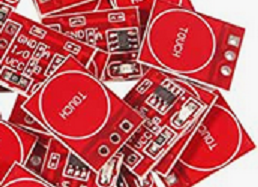

# Cap Switch Project

## Introduction

This project aims to create a capacitive touch switch that uses CR2016 button cells to power a capacitive touch sensor and solid state relay to to assist with switch-adapting a device for assistive technology purposes.

## Status

| Date       | Status                   |
| ---------- | ------------------------ |
| 2022-12-21 | First posting. Untested. |

## Todo

* Test sensor power draw for the sensor and the LED in relay.
* Add on-off switch?
* Compare the TTP223 and TTP223B.
* Label the outputs.
* Find out why the sensor text is rendered upside down (the footprint image is correct).

### Components

| Component                          | Source                                                       | Specs                                        |
| ---------------------------------- | ------------------------------------------------------------ | -------------------------------------------- |
| Capacitive touch sensor board (S1) | [HiLetgo TTP223 Cap Switch](https://smile.amazon.com/dp/B01D1D0FLG) (Amazon ) | 2.2-5.5V Toggle\|Momentary, Active High\|Low |
| Solid State Relay (K1)             | [Toshiba TLP241A](https://www.digikey.com/short/rw8vd8dn)    | Likely to be replaced with another SSR.      |
| Resistor (value TBD) (R1) 1206     |                                                              |                                              |
| Coin Cell Holder (B1)              | [Keystone 1026](https://www.digikey.com/short/f35w9mv4)      | (2) CR2016 or CR 2025 cells.                 |

## Mounting

The board is intended to be mounted with the cap sensor exposed. There are 3.5mm holes for securing with M3 screws or 3D printed posts.

On the bottom is a button cell holder for (2) CR2016 cells.

## Cap Touch Sensor

## Printed Circuit Board

## Top

### Bottom

